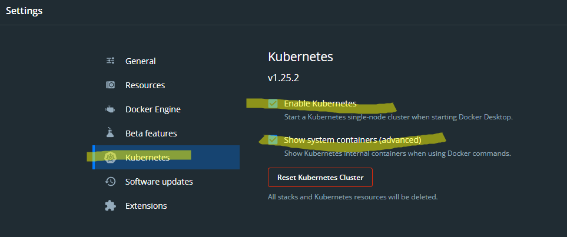
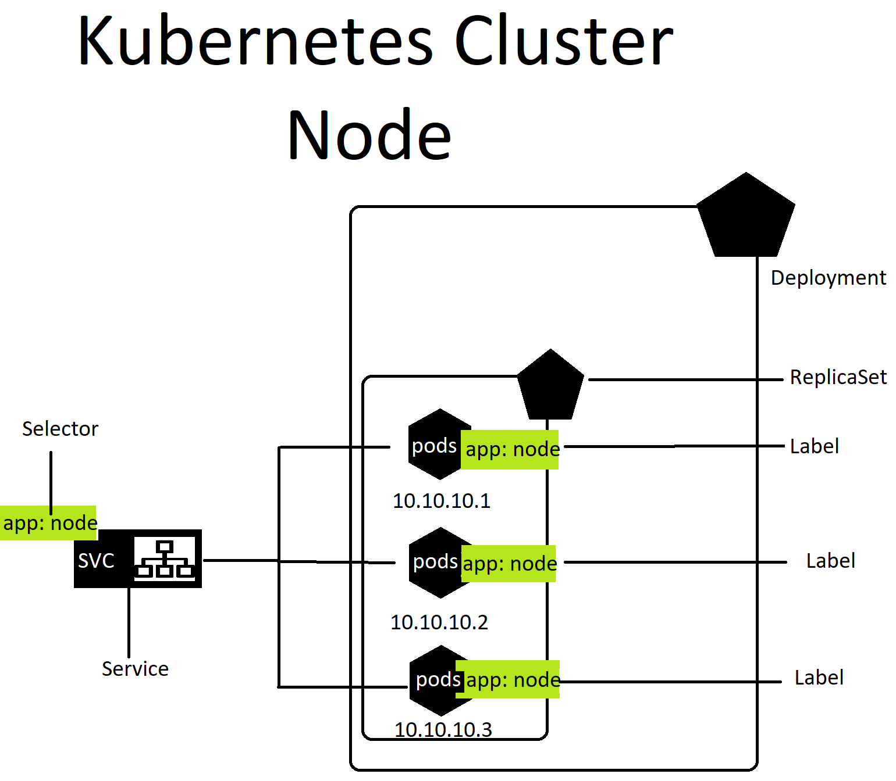

# Kubernetes

kubernetes has frown for a 173% bigger in indeed jobs. on top of this, it is used by 69% of all other container control service. <br/>
The way we can activate kubernetes in windows by going to the docker Desktop and going to settings and then kubernetes and make sure it is enabled <br/>


The download of the kubernetes if not yet enabled before or installed before, would take a few minutes, no more than 10mins.
To see if we have install or enabled kubernetes correctly, we can go to our terminal and with admin mode, run the command `kubectl` and we should receive a post as shown below.


```
kubectl controls the Kubernetes cluster manager.

 Find more information at: https://kubernetes.io/docs/reference/kubectl/

Basic Commands (Beginner):
  create          Create a resource from a file or from stdin
  expose          Take a replication controller, service, deployment or pod and expose it as a new Kubernetes service
  run             Run a particular image on the cluster
  set             Set specific features on objects

Basic Commands (Intermediate):
  explain         Get documentation for a resource
  get             Display one or many resources
  edit            Edit a resource on the server
  delete          Delete resources by file names, stdin, resources and names, or by resources and label selector

Deploy Commands:
  rollout         Manage the rollout of a resource
  scale           Set a new size for a deployment, replica set, or replication controller
  autoscale       Auto-scale a deployment, replica set, stateful set, or replication controller

Cluster Management Commands:
  certificate     Modify certificate resources.
  cluster-info    Display cluster information
  top             Display resource (CPU/memory) usage
  cordon          Mark node as unschedulable
  uncordon        Mark node as schedulable
  drain           Drain node in preparation for maintenance
  taint           Update the taints on one or more nodes

Troubleshooting and Debugging Commands:
  describe        Show details of a specific resource or group of resources
  logs            Print the logs for a container in a pod
  attach          Attach to a running container
  exec            Execute a command in a container
  port-forward    Forward one or more local ports to a pod
  proxy           Run a proxy to the Kubernetes API server
  cp              Copy files and directories to and from containers
  auth            Inspect authorization
  debug           Create debugging sessions for troubleshooting workloads and nodes

Advanced Commands:
  diff            Diff the live version against a would-be applied version
  apply           Apply a configuration to a resource by file name or stdin
  patch           Update fields of a resource
  replace         Replace a resource by file name or stdin
  wait            Experimental: Wait for a specific condition on one or many resources
  kustomize       Build a kustomization target from a directory or URL.

Settings Commands:
  label           Update the labels on a resource
  annotate        Update the annotations on a resource
  completion      Output shell completion code for the specified shell (bash, zsh, fish, or powershell)

Other Commands:
  alpha           Commands for features in alpha
  api-resources   Print the supported API resources on the server
  api-versions    Print the supported API versions on the server, in the form of "group/version"
  config          Modify kubeconfig files
  plugin          Provides utilities for interacting with plugins
  version         Print the client and server version information

Usage:
  kubectl [flags] [options]

Use "kubectl <command> --help" for more information about a given command.
Use "kubectl options" for a list of global command-line options (applies to all commands).

```

## applying node app with kubernetes


similar to deploying nginx docker with kubernetes, we can do the same with our node app, all we have to do is change the nginx image or our node image and make sure port 3000 is being listened.
in a new yaml file, we can write

```Yaml
apiVersion: apps/v1 # which api to use for deployment
kind: Deployment # What lind of service/object you want to create
# What would you like to call it - name service/object
metadata: 
  name: node-deployment # naming the deployment

spec: 
  selector:
    matchLabels:
      app: node_app # look for this label to match with k8 service
  # let's create a replica set of this with instance/pods
  replicas: 3
  # template to use it's label for k8 service to launch in the browser
  template:
    metadata:
      labels:
        app: node_app # This label connects to
                   # the service or any other k8 components
    # Let's define the container 
    spec:
      containers:
      - name: node_app
        image: jorge2091/eng130_jorge_nodejs # use the image that you built
        ports:
        - containerPort: 3000
```
To run this new 
kubeadm join 172.31.20.117:6443 --token dmvu2w.0tibsuk4bg30js9l \
    --discovery-token-ca-cert-hash sha256:defe339e7c066c8138478f9100961369cda8e018711f237eb2c3cfaaaa61dd63